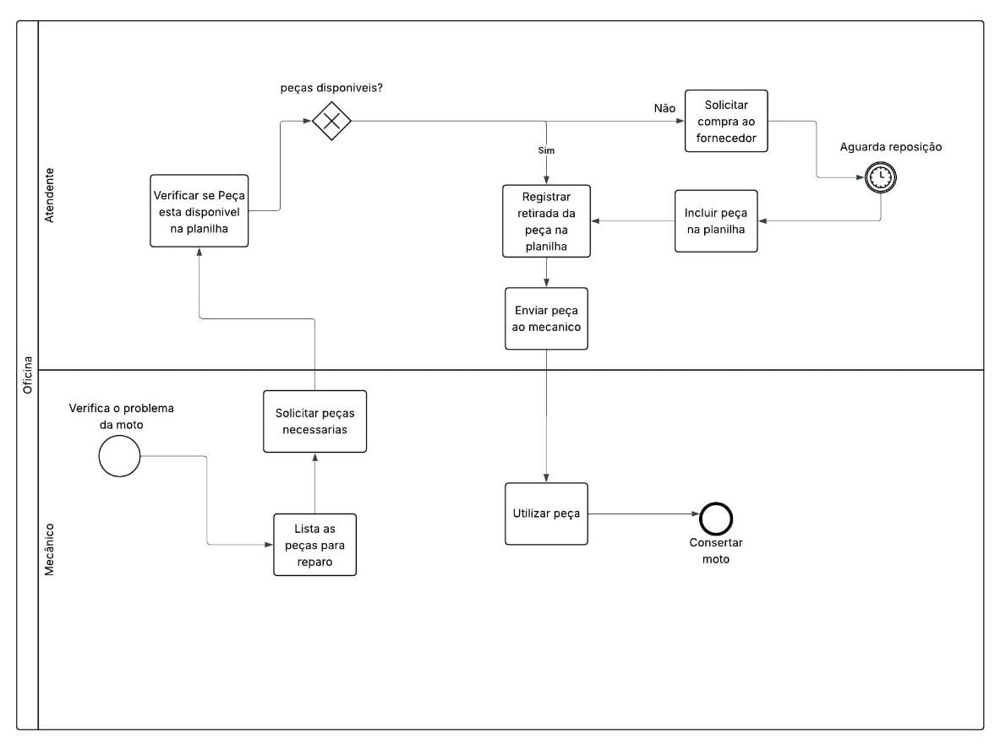
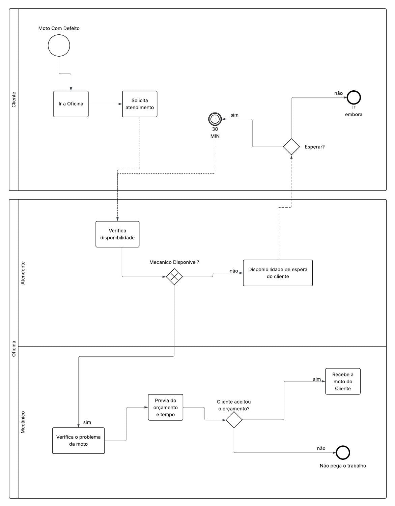
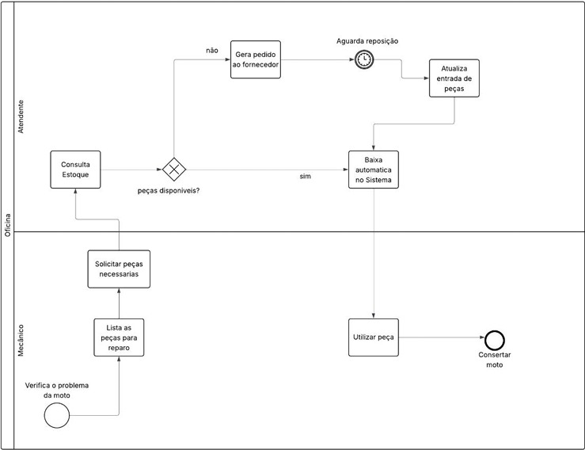
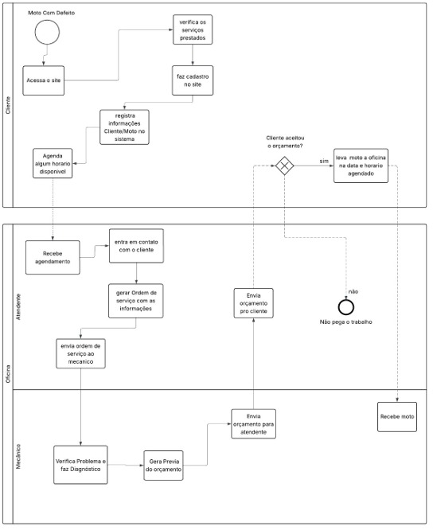

## 3. Modelagem dos Processos de Negócio

### 3.1. Modelagem da situação atual (Modelagem AS-IS)

Atualmente, a oficina **LAB Motos** realiza o controle de estoque de forma **manual**, utilizando planilhas do Excel.  
Esse processo apresenta diversos gargalos e limitações:

* **Cadastro de peças**: feito manualmente em planilhas, sujeito a erros de digitação e duplicidades.  
* **Entradas e saídas de peças**: registradas apenas quando lembrado, muitas vezes de forma incompleta.  
* **Consulta de disponibilidade**: colaboradores precisam verificar manualmente a planilha, o que gera lentidão no atendimento.  
* **Relatórios gerenciais**: não há geração automática; quando necessários, exigem manipulação manual das planilhas, demandando tempo e aumentando riscos de inconsistência.  
* **Gestão de fornecedores**: não há centralização; informações ficam dispersas, dificultando a análise da performance e prazos de entrega.  

Esse processo manual leva a **inconsistências nos registros, rupturas de estoque, perdas financeiras e atrasos no atendimento ao cliente**.  
Em síntese, o fluxo atual depende fortemente do esforço humano e não garante confiabilidade.  

1. Cliente solicita peça/manutenção  
2. Colaborador verifica manualmente na planilha  
3. Caso não encontre, consulta diretamente o proprietário  
4. Proprietário decide se compra ou não a peça  
5. Atualização manual da planilha (às vezes feita depois, gerando erros)  

---

### 3.2. Descrição geral da proposta (Modelagem TO-BE)

A solução proposta consiste em um **sistema informatizado de controle de estoque**, centralizado em banco de dados, que permitirá:  

* **Cadastro estruturado** de peças, fornecedores e clientes.  
* **Registro automatizado** de entradas e saídas de estoque.  
* **Consulta rápida** de disponibilidade de peças por qualquer colaborador.  
* **Geração de relatórios gerenciais** (estoque mínimo, movimentações, fornecedores mais utilizados, etc.).  
* **Alertas automáticos** para reposição de peças em risco de ruptura.  

Com isso, o processo será mais ágil, confiável e menos dependente de controles manuais.  
A solução se alinha diretamente à estratégia da oficina LAB Motos de **reduzir perdas, otimizar processos internos e aumentar a satisfação do cliente**.  

1. Cliente solicita peça/manutenção  
2. Colaborador consulta disponibilidade no sistema (em tempo real)  
3. Caso não disponível, sistema gera alerta e sugere fornecedor cadastrado  
4. Proprietário realiza pedido de reposição com base nos relatórios do sistema  
5. Entradas e saídas registradas automaticamente, com atualização imediata do estoque  

---

### 3.3. Modelagem dos processos

[PROCESSO 1 - Controle de Estoque (AS-IS e TO-BE)](./processos/processo-1-controle-estoque.md "Detalhamento do processo de controle de estoque.")  

[PROCESSO 2 - Gestão de Fornecedores (AS-IS e TO-BE)](./processos/processo-2-gestao-fornecedores.md "Detalhamento do processo de gestão de fornecedores.")  
